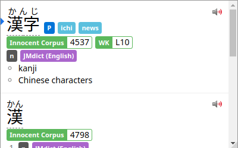

# Wanikani to Yomichan Metadata Converter

This project provides a script to convert all of [Wanikani](https://wanikani.com)'s Kanji and vocabulary subjects into a metadata dictionary for Yomichan (a feature mostly used and intended for frequency lists, for instance the [Innocent Corpus](https://foosoft.net/projects/yomichan/#dictionaries) frequency dictionary shared by Foosoft). Kanji and vocabulary that exist on Wanikani will be tagged with the level they appear in.  
The script makes use of the API documented at https://docs.api.wanikani.com/ .

Example:  


## Installation
Ensure you have Python 3 installed (minimum supported version _should_ be 3.6) in order to be able to execute the script. Furthermore make sure that the [`requests` library](https://docs.python-requests.org) is installed (e.g. `pip install requests`). After that clone the repository or just [download the script](https://raw.githubusercontent.com/rifuresshu/wk-to-yomichan-metadata-converter/main/wk-to-yomichan.py) and execute it with Python.

## Usage
In order to use this script, you need an account on Wanikani and an API key, which you can generate on [this page](https://www.wanikani.com/settings/personal_access_tokens). The API key does not need any extra permissions.  
Here's the help output of the script itself:  

```
usage: Converts all Wanikani kanji and vocab subjects into a Yomichan metadata dictionary
       [-h] [--api-key API_KEY] [--hidden {no,yes,learned}]

optional arguments:
  -h, --help            show this help message and exit
  --api-key API_KEY     your Wanikani API key. If you do not use this option, you will
                        be asked to enter it when you execute the script
  --hidden {no,yes,learned}
                        include hidden items (default: no)
```

The `--hidden` option is a small feature for including or excluding items marked as "hidden". With the option set to "learned" the script will retrieve all subjects for which you had an assignment in the past before the item was marked as hidden and which you had leveled up to the Guru stage.
